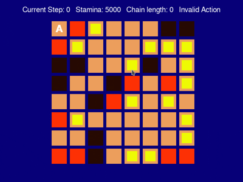

## Shover World
Shover-World is a custom Gym-compatible, grid-based reinforcement learning environment inspired by Sokoban. The agent (“the shover”) moves on a 2D grid, pushes chains of boxes, manages stamina costs, and interacts with lava and barriers. The environment supports perfect-square detection with two special actions (Barrier Maker and Hellify), stamina-based action mechanics, and optional Pygame rendering. It is designed for experimenting with discrete control, reward shaping, and environment dynamics.



### Run instructions
```sh
pip install -r requirements.txt
python3 main.py
```

### Tests
```sh
pip install -r requirements_dev.txt
pytest tests
```

### Environment Parameters
The `ShoverWorldEnv` class defines a grid-world environment designed for an agent tasked with navigating obstacles, managing resources, and interacting with various entities. Below is a detailed description of the parameters that can be configured upon instantiation of this environment.

---

| Parameter                    | Type               | Default Value  | Description                                                                                       |
|------------------------------|--------------------|----------------|---------------------------------------------------------------------------------------------------|
| `render_mode`                | str       | `'human'`      | Specifies the rendering mode. Use `'human'` for interactive visualization with Pygame or `None` for headless operation.    |
| `n_rows`                     | int              | None           | Defines the height of the grid world. The agent navigates within this vertical structure.                             |
| `n_cols`                     | int              | None           | Defines the width of the grid world. The agent navigates within this horizontal structure.                          |
| `max_timestep`               | int              | 400            | The maximum number of steps allowed in an episode. The episode will automatically truncate once this limit is reached. |
| `number_of_boxes`            | int              | 0              | The quantity of movable boxes introduced during random map generation.                                                   |
| `number_of_barriers`         | int              | 0              | The count of impassable barriers placed in the environment during random generation.                                   |
| `number_of_lavas`            | int              | 0              | The number of hazardous lava cells that may pose a risk to the agent during navigation.                                    |
| `initial_stamina`            | int              | 1000           | The stamina level assigned to the agent at the beginning of each episode.                                                          |
| `initial_force`              | float            | 1.0            | The base scalar applied in the stamina cost calculations which influences the agent's performance.                        |
| `unit_force`                 | float            | 1.0            | The scalar applied per cell in stamina cost calculations, impacting energy expenditure based on movement.                 |
| `perf_sq_initial_age`        | int              | 10             | Determines the initial age of perfect-square tiles, which dissolve after a defined age limit.                               |
| `map_path`                   | str | None       | None           | Specifies the path to a predefined map file (e.g., `.txt`). If provided, random map generation will not occur.        |
| `action_map`                 | dict[int, str]   | {1: 'up', 2: 'right', 3: 'down', 4: 'left', 5: 'barrier_marker', 6: 'hellify'} | Maps integers to action descriptions for clarity in interaction rather than using numeric values.                       |

---
